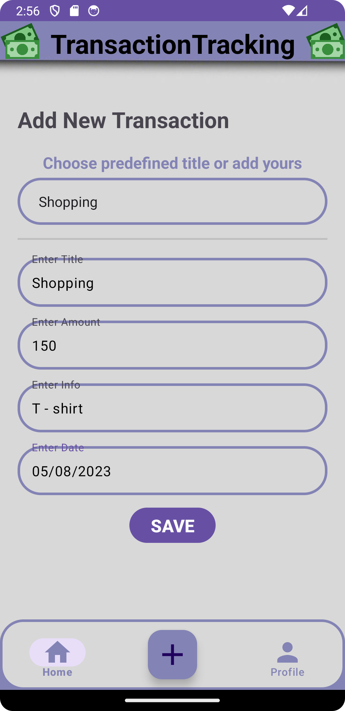
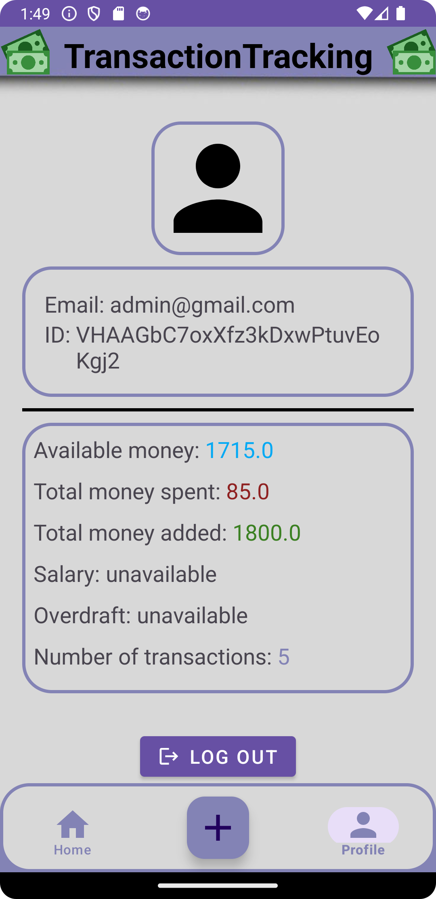

# Simple Transaction Tracker

This project was made in android studio version 2022.3.1 (Android Studio Giraffe Patch 4)

The idea is to simplify expense/income tracking as simple as posible for each registered user. Android app for managing user's transactions build with Kotlin and Firebase.

## User interface 

Pics of the app's user interface:

Pics

 

 

This app is the first android app that i've ever made, so there are still many things that can be improved and added.